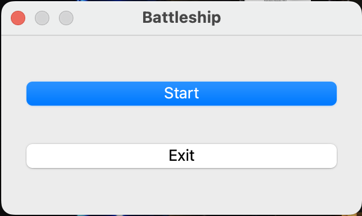
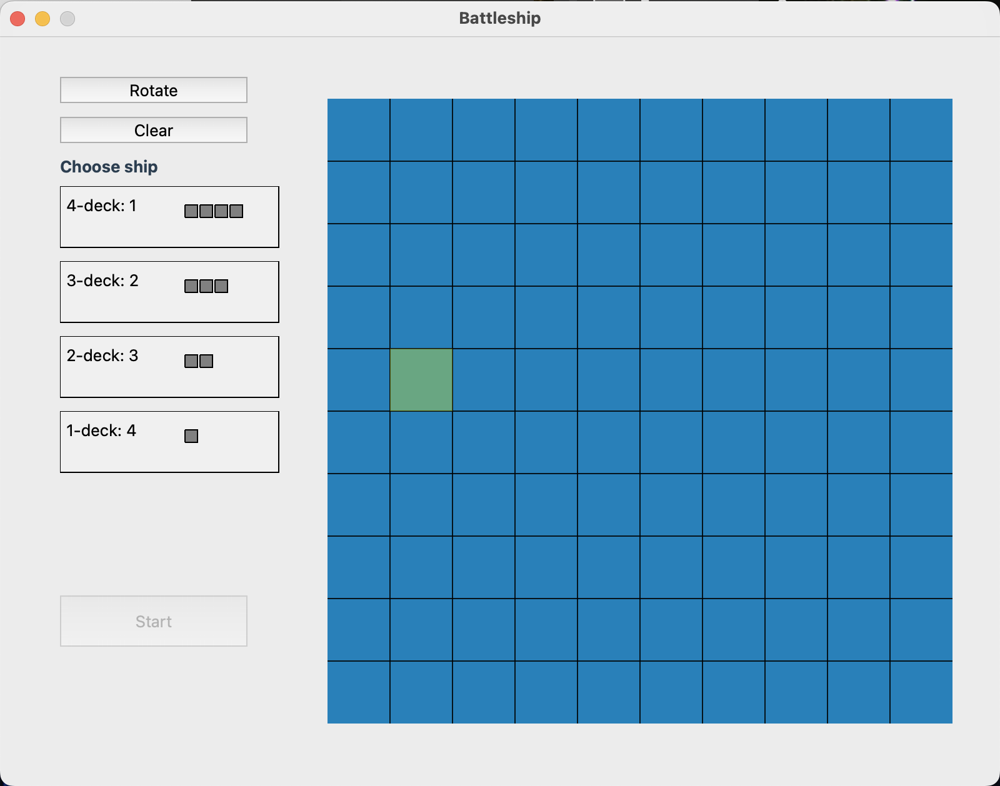
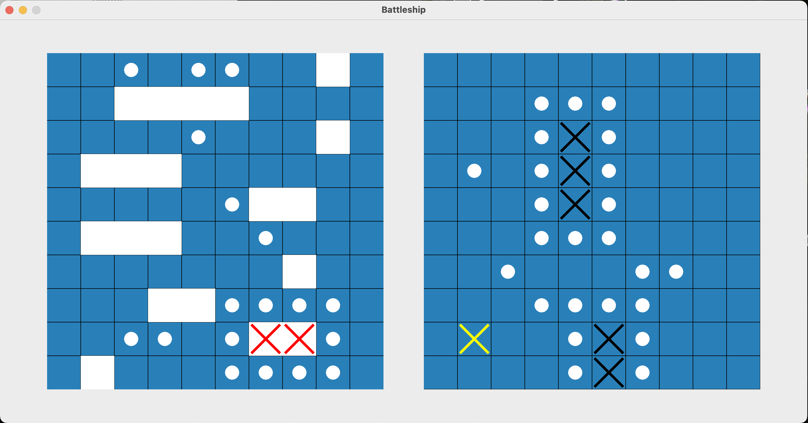

# BattleshipGame
#### This is simple Battleship game made by 4 young freshmen that have little experience in C++. You can place your ships on the field and then fight the bot.

### Getting started

#### To run this app, you need in any IDE with C++23, but also you need to install QT, or it will not work: https://doc.qt.io/qt-6/get-and-install-qt.html
#### Then you can download or clone repository and run `main.cpp`.
#### Otherwise, you can download app for macOS or Windows: https://drive.google.com/drive/folders/1xGiJ1LggVWGzZ9f612q9ugcR7Pi0ruU9?usp=sharing
#### Running on macOS:
1. Install `BattleshipGame.dmg` and put into `Applications`
2. Open the terminal and paste `xattr -cr /Applications/BattleshipGame.app`
3. Then paste codesign `--force --deep --sign - /Applications/BattleshipGame.app`
4. Play it! (We guarantee that your data will not be stolen)

#### Instruction for running on Windows will be soon!
### The Game
#### You will firstly meet main window. "Start" button leads to putting the ship, "Exit" to closing the app.

#### Then you need to make your fleet. To place you ships, click on one and then click on the place you want. To rotate it, press on "Rotate" button before placing the ship. To clear the field, press "Clear". When you have finished, go to the battlefield by clicking "Start".

#### On the battlefield, your field is left and bot's is right. Bot's field generates randomly. You start first. When you hit enemy's ship, there is the yellow cross. If it is destroyed, the cross is black. Have fun!

### Feedback
#### To contact us, write to alexstrelchen2006@gmail.com

### License
[MIT](https://choosealicense.com/licenses/mit/)